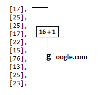
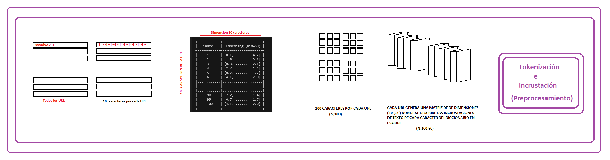
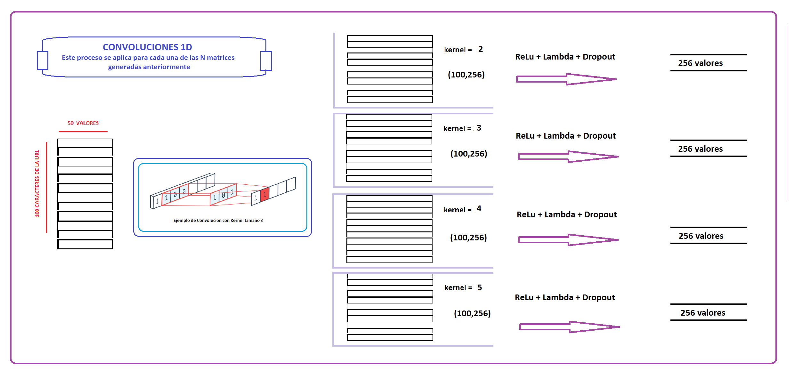
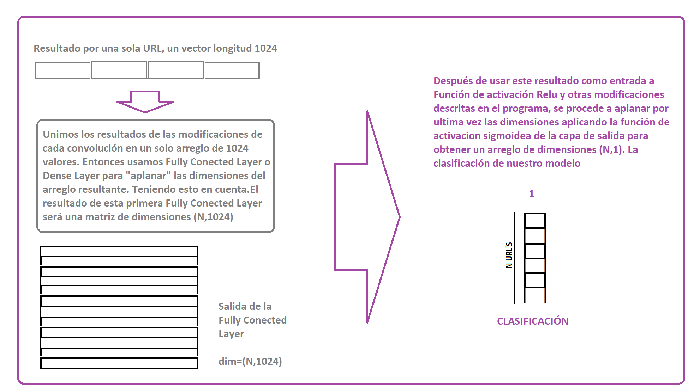
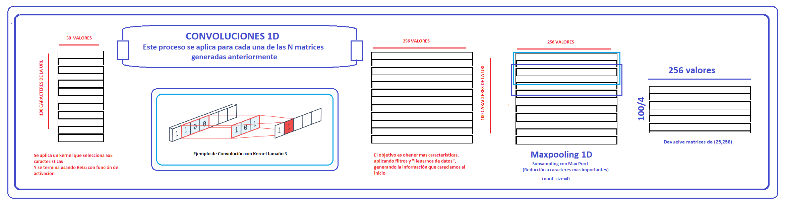
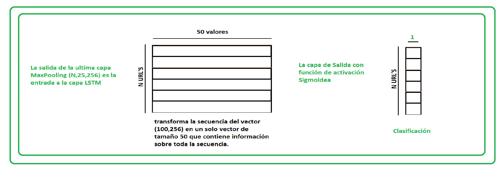

# Deep Learning para Detección de URL's Maliciosas (Phishing)


## Resumen
Se ha puesto a pensar de que la forma más fácil y desconcertante de que una persona obtenga su información personal es que simplemente nos la pida. Y si nos sentimos en confianza con esa persona procedemos a brindarle esa información sin siquiera sospechar los motivos detrás de esa extraña solicitud. **Esto es considerado un ataque de ingeniería.**

Actualmente los estafadores usan mensajes de correo electrónico, mensajes de texto para engañar y lograr obtener su información personal y si el destinatario confía ( o mejor dicho, no desconfía) del emisor entonces podría ser victima del robo de su información sensible. Y con esa información brindada voluntariamente, podría ser victima de un robo de identidad.

Todos los días, los estafadores lanzan miles de ataques de phishing como estos, y suelen tener éxito. Es cierto preguntarse ¿Quien puede caer en estos trucos? pero la respuesta es mas seria de lo que se cree, el Internet Crime Complaint Center del FBI reportó que la gente perdió $30 millones de dólares en un año con esquemas de phishing. 

## Introducción

El propósito de este proyecto es construir un clasificador que pueda detectar URL maliciosas. Esto se logrará utilizando un enfoque de aprendizaje profundo.

    Con un enfoque alternativo "Featureless Deep Learning", donde una capa de integración se encarga de derivar vectores de características de los datos sin procesar. Sin embargo, las desventajas de este enfoque son que se necesitan más data de entrenamiento y que la fase de entrenamiento requiera más tiempo.

### Enfoque Tradicional

Las investigaciones previamente realizadas se centraban en diferentes caracteristicas para la clasificación, entre ellas tenemos :

 1.**Características de BlackList**: verifique si está en alguna lista negras, pueden ser utiles pero nos encontramos con los problemas de que esas direcciones ya no existen o presentan falsos negativos.
 
 2.**Características léxicas**: bien sabemos que las url's tienden a parecerse bastante a las paginas originales, con pequeños cambios,ya sea usando caracteres especiales o la modificacion en la longitud de estas.

 3.**Características basadas en el host**: cuantifican las propiedades del host del sitio web como se identifica en la parte del nombre de host de la URL y básicamente responden "dónde" está alojado el sitio, "quién" lo posee y "cómo" se administra. Se necesitan consultas de API para este tipo de características (WHOIS, registros DNS). Algunas características de ejemplo pueden ser la fecha de registro, las geolocalizaciones, el número del sistema autónomo (AS), la velocidad de conexión o el tiempo de vida (TTL).
 
 4.**Características basadas en contenido**: esta es una de las familias de características menos utilizadas, ya que requiere la descarga de toda la página web, por lo tanto, la ejecución del sitio malicioso potencial, que no solo no es seguro, sino que también aumenta el costo computacional de derivando características. Las características aquí pueden estar basadas en HTML o JavaScript.
 
## Consideraciones Previas

El aprendizaje profundo se realiza de forma iterativa, donde la función de costo se optimiza hasta una convergencia aceptable, al igual que muchos otros algoritmos de aprendizaje automático. 

*lote de entrenamiento* es el número de datos de entrenamiento que se utilizan
*epoch* es un paso hacia adelante y hacia atrás de "todos" los datos de entrenamiento. *iteraciones* son el número de pases, donde para cada pase se utiliza el número de lotes de ejemplos de entrenamiento. 

Por ejemplo, para 1000 ejemplos de entrenamiento y un tamaño de **lote** de 500, se necesitarán 2 **iteraciones** para completar 1 **epoch**.

## Base de Datos

Para el fcorrecto funcionamiento del algoritmo, la base de datos está confirmada por un 50 % Urls's benignas y 50 % Url's Malicionsas.

Esta lista de Url's se obtubo de fuentes de datos de código abierto.

1. Url's Benignas 

    [Majestic](https://blog.majestic.com/development/majestic-million-csv-daily/)

2. Url's Maliciosas
    
    [Openphish](https://openphish.com/) 
    
    [Phishtank](https://www.phishtank.com/)
    
    [Other Projects](https://raw.githubusercontent.com/faizann24/Using-machine-learning-to-detect-malicious-URLs/master/data/data.csv)


El conjunto de datos contiene 21 2835 URL en total.

 ### Observaciones

*  Tenga en cuenta que para entrenar mejor los clasificadores de Deep Learning se necesitan muchos más datos. 
* Los datos se recopilaron de fuentes abiertas o reportadas por usuarios, es decir, podrían no considerarse una muestra representativa
* Las URL maliciosas tienden a cambiar con el tiempo o simplemente dejas de existir, por lo tanto, será necesaria una reentrenamiento continuo.

## Prepocesamiento de la Data recién obtenida (Tokenización)

La cadena de URL sin procesar debe dividirse en "caracteres". Esto requiere construir un diccionario primero. En este caso se usara un diccionario de python para caracteres imprimibles.El cual asigna una posicion en el diccionario acorde a su codigo ASCII.



Se tomarán como restricciones que para cada URL se deben tomar como maximo 100 de estos caracteres, con ello manejamos una matriz de (m,n) donde ***m*** es la cantidad de datos y ***n*** es 100


## Incrustación de Palabras :: Word2vec (Procesamiento de lenguaje Natural)

Los sistemas de procesamiento de imágenes o de video trabajan con conjuntos de datos multidimensionales muy ricos en información que se codifican como vectores. Tenemos el caso de que una imagen puede ser representados por 3 matrices, en cada una la intensidad de un color determinado por pixel, pero al tratarse de palabras, nos econtramos con el dilema que solo podemos tratarlos como valores individuales (ya sean los caracteres). 

En el caso que tenemos, cada caracter es representado por un **index** del diccionario en python que manejamos, por ejemplo podemos relacionar la "g" con 16 y la "o" con 24 pero estas codificaciones no proporcionan información sobre las relaciones que pueden existir entre lcaracteres. Peor aún, esta representación tiene como consecuencia una dispersión de los datos importante por lo que implica que los entrenamientos necesitan más datos para ofrecer buenos modelos.

----------------
### Modelo con palabras
------------------

Una forma de trabajar con esto es creando una representación vectorial de manera que por cada palabras haya una representación vectorial que indique la relaciónes de semantica entre las demás palabras, acorde a la data de entrenamiento proporcionada.

Un modelo particularmente eficiente desde el punto de vista computacional es ***Word2vec***. 
Dado un conjunto de frases (también llamado corpus) el modelo analiza las palabras de cada sentencia y trata de usar cada palabra para predecir que palabras serán vecinas. Por ejemplo, a la palabra “Caperucita” le seguirá “Roja” con más probabilidad que cualquier otra palabra.

```
Lo que hacemos en este trabajo es tomar el caso general de procesar conjuntos de palabras para darle un sentido a la frase y contextualizarlo a un caso mas especifico, tomar un conjunto de caracteres y darle sentido a una palabra (URL)
``` 
----------------
### Modelo con caracteres. ¿Cómo funciona?
------------------

La finalidad de un Incruste en una Red Neuronal es mapear objetos con significado similar a puntos cercanos, con ello se pueden formar vecindades.


Para ello es necesario transforma los objetos a un espacio donde sean comparables, con ello se les puede procesar en un sistema de aprendizaje de máquina.(Por eso tokenizamos los caracteres). De esta manera es posible analizar relaciones.

En nuestro caso usaremos un incruste para obtener una medida de similaridad entre los caracteres de cada URL.


```

Cada URL genera una matriz similar a esta, por ende al aplicar la capa de incrustación de palabras obtenemos un resultado de dimensiones (N,100,50)

+------------+---------------------+
|   index    |  Embedding (Dim=50) |
+------------+---------------------+
|     1      | [0.1, ........ 4.2] |
|     2      | [1.0, ........ 3.1] |
|     3      | [0.3, ........ 2.1] |
|     4      | [2.2, ........ 1.4] |
|     5      | [0.7, ........ 1.7] |
|     6      | [4.1, ........ 2.0] |
|............|.....................|
|............|.....................|
|............|.....................|
|     98     | [2.2, ........ 1.4] |
|     99     | [0.7, ........ 1.7] |
|     100    | [4.1, ........ 2.0] |
+------------+---------------------+
```

Se pueden ver relaciones interesantes de caracteres que tienden a aparecer en contextos similares.

## Entradas y Salidas de las Capas de la red neuronal

La capa inicial siempre es una capa de entrada donde se define la forma de entrada inicial (aquí los 75 caracteres iniciales de la URL)

```python
main_input = Input(shape=(max_len,), type='int32', name='main_input')
```


Lo siguiente es la capa word2vec, que se basa en la capa de entrada principal y es donde saldrán los caracteres importantes. Aqui es donde se iniciaran las "*incrustaciones*", se explicará con mas detalle en el siguiente apartado .

 ```python
emb = Embedding(input_dim=max_vocab_len, output_dim=emb_dim, input_length=max_len,
                dropout=0.2, W_regularizer=W_reg)(main_input)
 ```
A partir de ahi, la formación de capaz vendrá dada por este formato

```python
first_layer = <LayerType>(<parameters>)(main_input)
<next_layer> = <LayerType>(<parameters>)(first_layer)
<penultimate_layer> = <LayerType>(<parameters>)(<next_layer>)
```

Es en la ultima capa donde se hace la clasificación, en este caso una clasificación binaria (Es o no es phishing), por ende usaremos la función de activación sigmoidea.

```python
output = Dense(1, activation='sigmoid', name='output')(<penultimate_layer>)
```

## Arquitectura en KERAS


Después de la capa de incrustación de word2vec.Tenemos una matriz 2D de "características" para cada URL y en estos casos debemos tratar con solo una matriz resultante.




Para esto tenemos dos posibles caminos:

### Primer Modelo: 1D Convolution +  Fully Conected 

Consiste en realizar Convoluciones con parametros diferentes y luego fusionar estos resultados utilizando la capa ***Fully Connected*** o ***Dense*** para aplanar las dimensiones del arreglo resultante.

Entrando mas a detalle, por cada url se generan 4 matrices de dimensiones (100,50), cada una es generado por una capa de convolución.Ahora, cada matriz es la entrada para capaz de activación Relu, Lambda y Dropout. La función lambda, para este código, reduce las dimensiones a un vector de longitud 256.



Luego de que se obtengan 4 vectores de longitud 256 correspondientes a las 4 convoluciones diferentes, estas se ***fusionan*** obteniendo un vector de longitud **1024**.A este proceso es el de la capa "Fully Conected", tambien conocido como capa "Dense". Cuyo trabajo es cambiar las dimensiones *** ( aplanar) *** la matriz resultante. Despues de ello tenemos una matriz de dimensiones (N, 1024).

Esa matriz sirve como entrada para diferentes capas con función de activación Relu y modificaciones (normalizaciones.) Despues de ello, tenemos la capa de salida con función de activacion sigmoidea, la cual nos muestra las probabilidades de cada URL



### Segundo Modelo: 1D Convolution + LSTM

La que consiste en capas de Convolucion 1D y para poder trabajar con los datos en 3D debemos reducirlos a 2D con la capa LSTM, a partir de ahi ya podemos usar la capa de salida con la función de activación sigmoide.

Entrando más a detalle, por cada url se generó una matriz de dimensiones (100,50), la primera capa se encargará de aplicarle filtros con un kernel de tamaño 5 con la intención de poder obtener más información a partir de los datos obtenidos.

Luego de ello (haber generado una matriz de dimensiones (100,256) por cada URL, se aplica el MaxPooling en 1D con la intención de empezar a reducir, manteniendo la información más relevantes.(Después de ello tenemos una matriz de dimensiones (25,256).



La salida de la capa Max Pooling es de una dimensión de (N,25,256) donde N es la cantidad de URL dadas para el entrenamiento.La salida de la última se utiliza como entrada para una LSTM la cual transforma la matriz (25,250) en un vector de dimensión 50, el cuál concentra la información esencial.Por ende, la salida de esta capa es una matriz de dimensiones (N,50)

Es a partir de este punto, que ya podemos pasar esta información a una capa de salida y usar la función de activación sigmoidea.



## Realizando una predicción

Tokenizamos los URL que vamos a probar

```python
#URL para predecir
test_url_mal1 = "www.facel00k.com/mlost1/"
test_url_ben1 = "www.facebook.com/mlost1/"
test_url_mal2 = "naureen.net/etisalat.ae/index2.php"
test_url_ben2 = "sixt.com/php/reservation?language=en_US"
test_url_mal3 = "tottus.supercupones.net"
test_url_mal4 = "netfIix.com"

url = np.array([test_url_ben1,test_url_mal1,test_url_ben2,test_url_mal2,test_url_mal3,test_url_mal4])

#Tokenizamos
max_len=100
url_int_tokens = [[printable.index(x) + 1 for x in url if x in printable]for url in url]
X = sequence.pad_sequences(url_int_tokens, maxlen=max_len)

proba = model2.predict(X, batch_size=1)
def print_result(proba,x):
    if float(proba[x]) > 0.5:
        return "no es segura"
    else:
        return "es segura"


    
for x in range(len(url)):
    print("La página",url[x],"\t", print_result(proba,x),"\n\t con la probabilidad de que sea phishing del ",\
          round(float(proba[x]),2), "%" )
```
```
La página www.facebook.com/mlost1/ 	 es segura 
	 con la probabilidad de que sea phishing del  0.34 %
La página www.facel00k.com/mlost1/ 	 no es segura 
	 con la probabilidad de que sea phishing del  0.88 %
La página sixt.com/php/reservation?language=en_US 	 es segura 
	 con la probabilidad de que sea phishing del  0.0 %
La página naureen.net/etisalat.ae/index2.php 	 no es segura 
	 con la probabilidad de que sea phishing del  0.99 %
La página netflix.com 	 no es segura 
	 con la probabilidad de que sea phishing del  0.69 %
La página tottus.supercupones.net 	 no es segura 
	 con la probabilidad de que sea phishing del  0.92 %
La página netfIix.com 	 no es segura 
	 con la probabilidad de que sea phishing del  0.73 %
     ```
## Conclusiones

* En cuestión de precisión, el segundo modelo (1D CONVOLUTION + LSTM) da un mejor resultado, con una precision de ***94.96 %***, mientras que el primer modelo (1D CONVOLUTION + FULLY CONECTED) tiene una precisión de  ***86.20 %***

* El tiempo de entrenamiento es definitivamente más largo y la precisión no necesariamente mejor en comparación con el aprendizaje automático más tradicional, sin embargo, puede generalizarse mejor a las URL maliciosas del mañana.(En especial a las que no tienen sentido)

* Una de las desventajas es la deficiencia al encontrarse con nuevas palabras, lo cual es un indicador del correcto funcionamiento del modelo.


## Bibliografía

### word2vec

* https://medium.com/@gruizdevilla/introducci%C3%B3n-a-word2vec-skip-gram-model-4800f72c871f

* https://qastack.mx/stats/270546/how-does-keras-embedding-layer-work

* http://personal.cimat.mx:8181/~mrivera/cursos/aprendizaje_profundo/embedding/embedding.html

### Convolucion1D

* https://www.aprendemachinelearning.com/como-funcionan-las-convolutional-neural-networks-vision-por-ordenador/

* https://stackoverflow.com/questions/46503816/keras-conv1d-layer-parameters-filters-and-kernel-size

### LSTM

* https://pdfs.semanticscholar.org/37d4/dd4a6535bef307325164891f16bcdd293721.pdf

* https://towardsdatascience.com/understanding-lstm-and-its-quick-implementation-in-keras-for-sentiment-analysis-af410fd85b47

## algo mas

LSTM para redes recurrentes básicas.
Memorias de corto plazo, generar nombres cuando el nombre es corto, reder recurrentes basicas,


RNN(Datoactual y estado ocurlto anterior) y genera un nuevo estado oculto geenenando 

recordar un dato relevante, y usarlo despues (largo plazo), no enfocamos en caracterizticas relevantes


Consejos para la limpieza de texto para incrustación de palabras
Recientemente, el campo del procesamiento del lenguaje natural se ha ido alejando de los modelos de Bag of Words y de la codificación de palabras hacia las incrustaciones de palabras. El beneficio de las incrustaciones de palabras es que codifican cada palabra en un vector denso que captura algo acerca de su significado relativo dentro del texto de capacitación. Esto significa que las variaciones de palabras como mayúsculas, minúsculas, ortografía, puntuación, etc. se aprenderán automáticamente a ser similares en el espacio de incrustación. A su vez, esto puede significar que la cantidad de limpieza requerida de su texto puede ser menor y quizás bastante diferente a la limpieza de texto clásica. Por ejemplo, puede que ya no tenga sentido detener las palabras o eliminar la puntuación de las contracciones.

